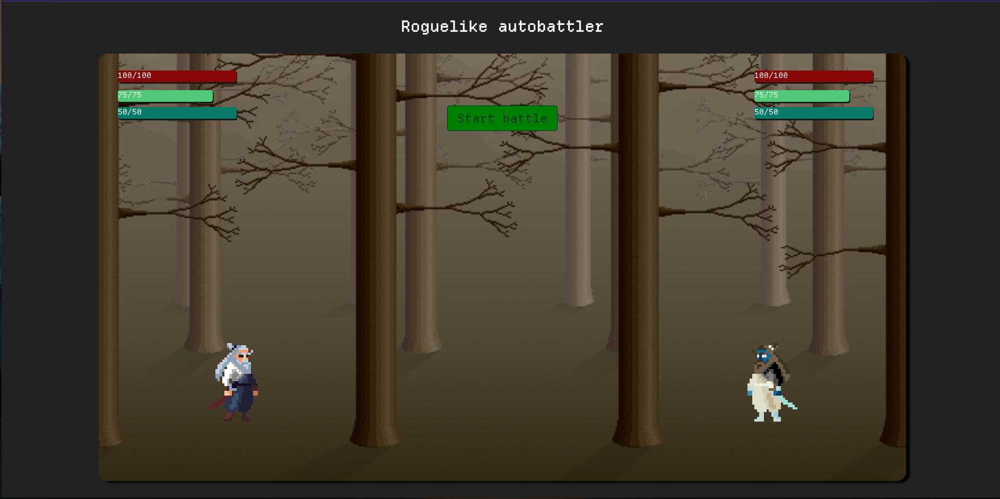

## Roguelike auto-battler in typescript

I decided to get back into nodeJS and typescript during my christmas vacation, so I had an idea to create an autobattler that runs in the browser. It's a work in progress.

### Tech stack:
Frontend:
    - HTML 
    - CSS 
    - vanilla JS

Backend:
    - NodeJS
    - Express
    - Typescript
    - Prisma
    - Postgres

### Asset credits:
<ul>
    <li>https://xzany.itch.io/samurai-2d-pixel-art</li>
    <li>https://www.spriteland.com/sprites/tall-trees-background</li>
</ul>
